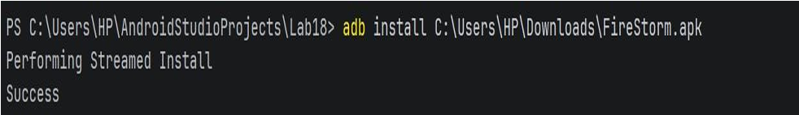
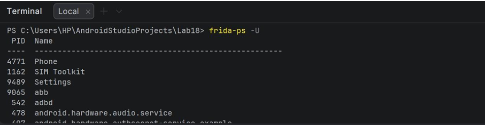
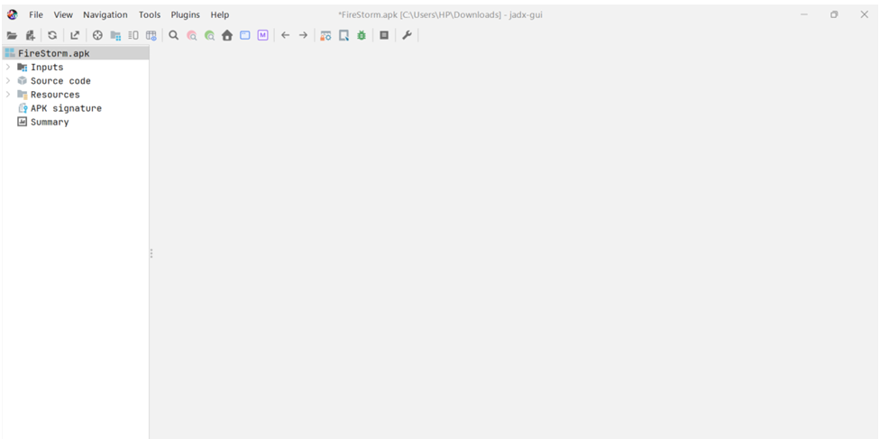
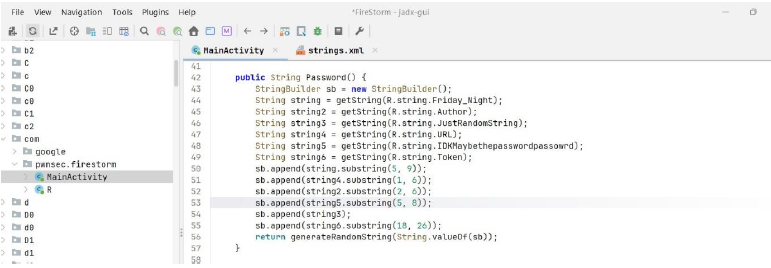
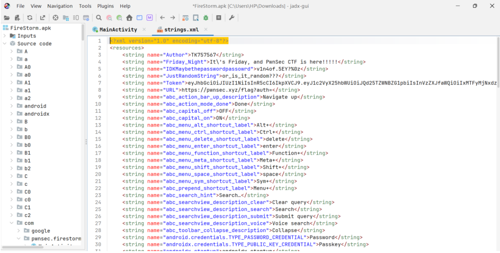
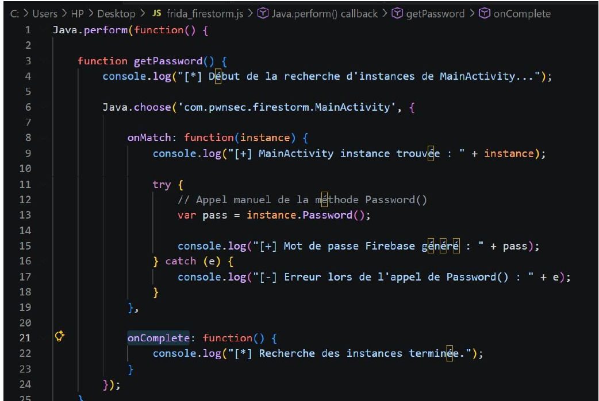
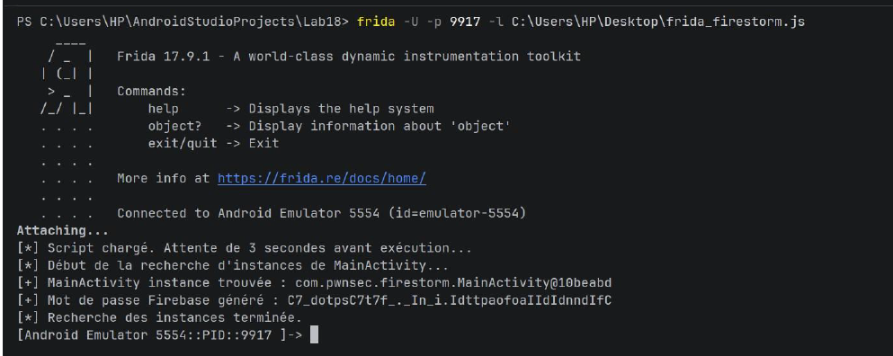
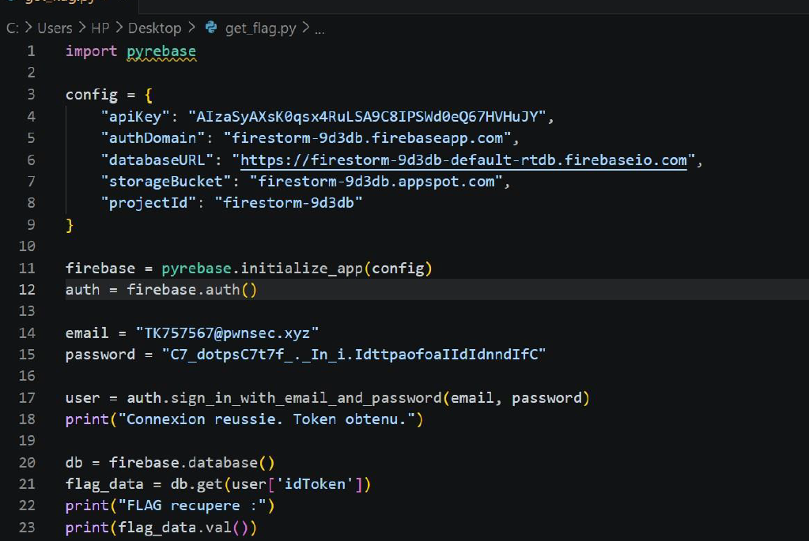
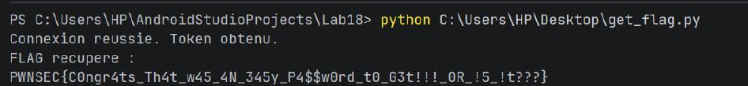

## LAB 18 — FireStorm (Analyse + Exploitation avec Frida)
## Auteur

Chaimaa ELGADAOUI
Étudiante en 2ème année — Génie Cyberdéfense & Systèmes de Télécommunications Embarqués

## Objectif du challenge

Dans ce lab, j’ai analysé une application Android contenant une fonction cachée qui génère un mot de passe Firebase.

Cette fonction n’est jamais appelée dans le flux normal de l’application.
Mon objectif était de :

* Identifier cette fonction avec Jadx
* Forcer son exécution avec Frida
* Récupérer le mot de passe généré
* M’authentifier sur Firebase
* Récupérer le flag final

## Structure du projet
LAB18_FireStorm/
├── README.md
├── frida_firestorm.js
├── get_flag.py
├── FireStorm.apk
└── images/

### Étape 1 — Préparation de l’environnement

J’ai commencé par installer l’APK sur mon appareil Android.

adb install FireStorm.apk

Ensuite, j’ai vérifié que Frida fonctionne correctement :

frida-ps -U

À ce stade, je me suis assuré que :

* l’application est installée
* frida-server est actif
### Étape 2 — Analyse statique avec Jadx

J’ai ouvert l’APK dans Jadx-GUI afin d’analyser le code source.

## Analyse de MainActivity

J’ai identifié la classe principale :

com.pwnsec.firestorm.MainActivity

Dans cette classe, j’ai trouvé une méthode très intéressante :

* public String Password()

Ce que j’ai compris

J’ai remarqué que :

* La fonction construit un mot de passe
* Elle utilise des strings depuis strings.xml
* Elle appelle une fonction native (generateRandomStrings)
* Elle n’est appelée nulle part dans l’application

Conclusion :

Le mot de passe existe mais il est caché → il faut forcer son exécution

## Analyse du fichier strings.xml

J’ai ensuite analysé le fichier strings.xml.

J’ai trouvé :

* Email Firebase
* API Key
* URL Firebase

### Étape 3 — Exploitation avec Frida

J’ai créé un script Frida pour appeler la fonction Password().

Exécution du script

Résultat : 
* Le script a affiché le mot de passe Firebase.
## Étape 4 — Script Python

J’ai créé un script Python pour me connecter à Firebase.

* Exécution
python get_flag.py
Après exploitation, j’ai réussi à récupérer le flag depuis Firebase.

### Conclusion

Ce challenge m’a permis de comprendre l’importance de l’analyse dynamique en complément de l’analyse statique.

Même si une fonction n’est pas utilisée dans l’application, elle peut être exploitée avec des outils comme Frida.

Cela montre que :

Toute logique présente dans le code peut être attaquée, même si elle est cachée
